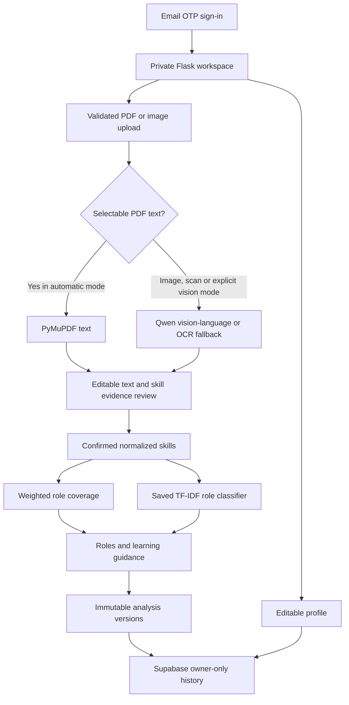

# Historical notes (pre-authentication-removal)

This document describes the former account-based implementation. Login, OTP,
Supabase persistence and server runtime setup below are obsolete for the current
anonymous app. See README.md and docs/VERCEL_DEPLOYMENT.md for active behavior.

# Architecture and important modules

- `extraction.py`: file validation, PDF text/rendering, OCR and Ollama's image-based API.
- `skills.py`: vocabulary aliases, boundaries, source quotes and basic review cautions.
- `analysis.py`: required weights, separate classifier signal, optional JD match and version comparison.
- `auth.py`: Supabase OTP or local terminal OTP, request throttling and server sessions.
- `storage.py`: one simple interface for demo SQLite or Supabase REST.
- `app.py`: the routes connecting forms, review, analysis and storage.

In demo mode, SQLite stores user results. In Supabase mode, the same user workflow uses cloud Auth/Postgres. Short-lived drafts and server sessions are local in both modes. The role catalog is versioned JSON rather than a live job feed. A JSON result contains the role comparisons to keep the database simple.
